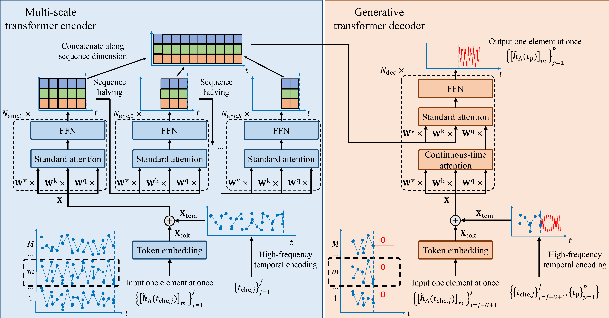
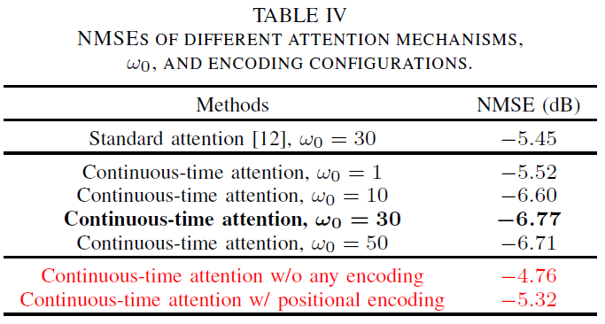
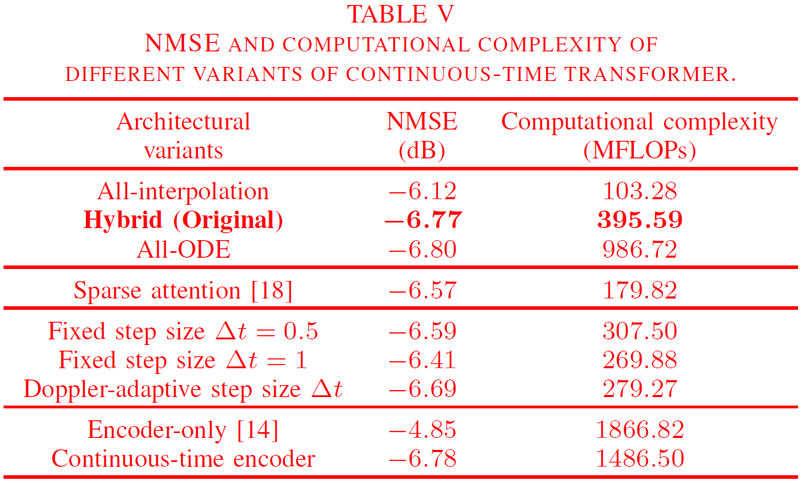
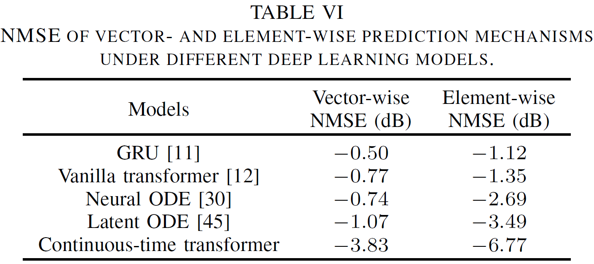
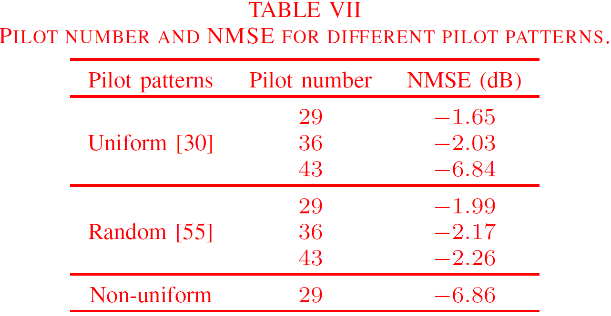
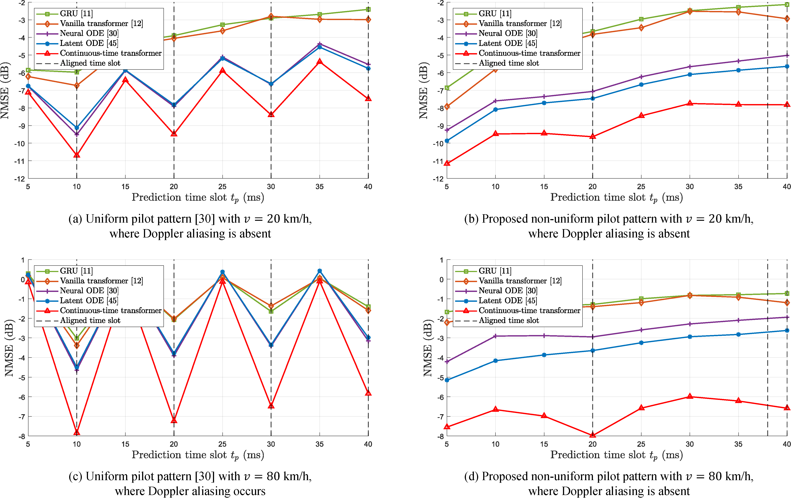
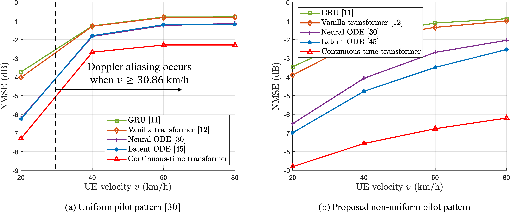
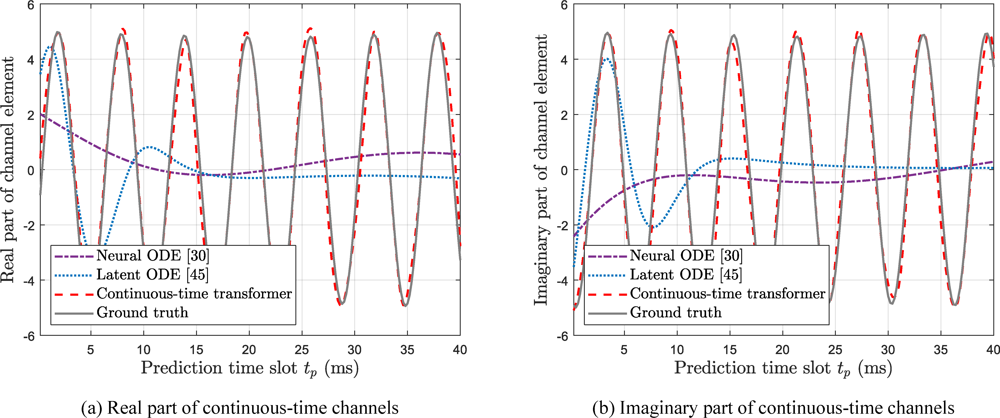

# Continuous-Time-Transformer-For-Channel-Prediction
The pytorch implementation of our paper “Continuous-Time Transformer Based Channel Prediction with Non-Uniform Pilot Pattern”.

<p align="center">

</p>

## Checkpoint and test data set download
Please download checkpoint (.pth format) and test data set (.mat format) from Tsinghua Cloud: https://cloud.tsinghua.edu.cn/d/b369c2aab6b445e7a067/. Then, extract them in the corresponding `./checkpoint`, `./3GPP_dataset`, and `./deepmimo_dataset` folders.  

## File Description
 - `./3GPP_dataset` containing test dataset of 3GPP TR 38.901 channels.
 - `./deepmimo_dataset` containing test dataset of DeepMIMO channels.
 - `./checkpoint` containing all trained models.
 - `./eval_code` containing all runnable codes for validating the simulation results in the original paper.

Taking the folder `./eval_code/TabIV_attention_omega0_encoding/` as an example (other folders are similar), a detailed overview of the code structure and functionality is shown as below:
 - `./eval_code/TabIV_attention_omega0_encoding/dataloader_ODE.py`: dataset loading file.
 - `./eval_code/TabIV_attention_omega0_encoding/model_ODE.py`: model definition file.
 - `./eval_code/TabIV_attention_omega0_encoding/utils.py`: utility file.
 - `./eval_code/TabIV_attention_omega0_encoding/models/`: folder containing detailed model structure definitions.
 - `./eval_code/TabIV_attention_omega0_encoding/configs/`: folder containing parameter configuration.
 - `./eval_code/TabIV_attention_omega0_encoding/eval_ODE.py`: main file for validation.
 - `./eval_code/TabIV_attention_omega0_encoding/cmd_code.txt`: terminal commands.
 - `./eval_code/TabIV_attention_omega0_encoding/print_results_TabIV.m`: MATLAB code for displaying results.

## Keyword arguments
In our code, we have provided detailed annotations. Below are the specific meanings of some keywords:
 - `b` batch size.
 - `M` BS antenna number.
 - `his_len` estimation sequence length.
 - `pre_len` prediction sequence length.
 - `label_len` label length for transformer decoder.

## Reproduce the experimental result
***Note: In the following, let us use `your_path` to denote the directory where our project is located on your computer.***

* For Table IV in the original paper, please run the following commands step by step in your terminal

<p align="center">

</p>

```
cd your_path/eval_code/TabIV_attention_omega0_encoding
python eval_ODE.py --time_emb_kind HFTE --omega_0 30 --dec_ctsa False --result_idx r1
python eval_ODE.py --time_emb_kind without --result_idx r2
python eval_ODE.py --time_emb_kind PE --result_idx r3
python eval_ODE.py --time_emb_kind HFTE --omega_0 1 --result_idx r4
python eval_ODE.py --time_emb_kind HFTE --omega_0 10 --result_idx r5
python eval_ODE.py --time_emb_kind HFTE --omega_0 30 --result_idx r6
python eval_ODE.py --time_emb_kind HFTE --omega_0 50 --result_idx r7
```

The results are saved to `.mat` files, and you can run `print_results_TabIV.m` to print results. 

* For Table V in the original paper, please run the following commands step by step in your terminal

<p align="center">

</p>

```
cd your_path/eval_code/TabV_architectural_variants
python eval_ODE.py --model_name CT_Transformer --continuous_qkv_method interp interp interp --result_idx r1
python eval_ODE.py --model_name CT_Transformer --continuous_qkv_method interp interp ode --result_idx r2
python eval_ODE.py --model_name CT_Transformer --continuous_qkv_method ode ode ode --result_idx r3
python eval_ODE.py --model_name CT_Transformer --continuous_qkv_method interp interp ode --ct_attn ct_prob --result_idx r4
python eval_ODE.py --model_name CT_Transformer_encoderonly_v0 --result_idx r5
python eval_ODE.py --model_name CT_Transformer --enc_ctsa True --result_idx r6
```

The results are saved to `.mat` files, and you can run `print_results_TabV.m` to print results. 

* For Table VI in the original paper, please run the following commands step by step in your terminal

<p align="center">

</p>

```
cd your_path/eval_code/TabVI_vector_element
python eval_ODE.py --model_name Vanilla_GRU --input_mechanism Channel_mixing --result_idx r1
python eval_ODE.py --model_name Vanilla_GRU --input_mechanism Channel_independent --result_idx r2
python eval_ODE.py --model_name Vanilla_Transformer --input_mechanism Channel_mixing --result_idx r3
python eval_ODE.py --model_name Vanilla_Transformer --input_mechanism Channel_independent --result_idx r4
python eval_ODE.py --model_name Neural_ODE --input_mechanism Channel_mixing --result_idx r5
python eval_ODE.py --model_name Neural_ODE --input_mechanism Channel_independent --result_idx r6
python eval_ODE.py --model_name Latent_ODE --input_mechanism Channel_mixing --result_idx r7
python eval_ODE.py --model_name Latent_ODE --input_mechanism Channel_independent --result_idx r8
python eval_ODE.py --model_name CT_Transformer --input_mechanism Channel_mixing --result_idx r9
python eval_ODE.py --model_name CT_Transformer --input_mechanism Channel_independent --result_idx r10
```

The results are saved to `.mat` files, and you can run `print_results_TabVI.m` to print results. 

* For Table VII in the original paper, please run the following commands step by step in your terminal

<p align="center">

</p>

```
cd your_path/eval_code/TabVII_pilot_overhead
python eval_ODE.py --intepolate_pilot_method uniform --intepolation_points_num 3 --result_idx r1
python eval_ODE.py --intepolate_pilot_method uniform --intepolation_points_num 4 --result_idx r2
python eval_ODE.py --intepolate_pilot_method uniform --intepolation_points_num 5 --result_idx r3
python eval_ODE.py --intepolate_pilot_method random --intepolation_points_num 3 --result_idx r4
python eval_ODE.py --intepolate_pilot_method random --intepolation_points_num 4 --result_idx r5
python eval_ODE.py --intepolate_pilot_method random --intepolation_points_num 5 --result_idx r6
python eval_ODE.py --intepolate_pilot_method chebyshev --intepolation_points_num 3 --result_idx r7
```

The results are saved to `.mat` files, and you can run `print_results_TabVII.m` to print results. 

* For Figure 6 and Figure 7 in the original paper, please run the following commands step by step in your terminal

<p align="center">

</p>

<p align="center">

</p>

```
cd your_path/eval_code/Fig67_pilot_pattern_deep_learning_model
python eval_ODE.py --model_name Vanilla_GRU --UE_velocity 20kmh --intepolate_pilot_method uniform --result_idx r1
python eval_ODE.py --model_name Vanilla_GRU --UE_velocity 40kmh --intepolate_pilot_method uniform --result_idx r2
python eval_ODE.py --model_name Vanilla_GRU --UE_velocity 60kmh --intepolate_pilot_method uniform --result_idx r3
python eval_ODE.py --model_name Vanilla_GRU --UE_velocity 80kmh --intepolate_pilot_method uniform --result_idx r4
python eval_ODE.py --model_name Vanilla_GRU --UE_velocity 20kmh --intepolate_pilot_method chebyshev --result_idx r5
python eval_ODE.py --model_name Vanilla_GRU --UE_velocity 40kmh --intepolate_pilot_method chebyshev --result_idx r6
python eval_ODE.py --model_name Vanilla_GRU --UE_velocity 60kmh --intepolate_pilot_method chebyshev --result_idx r7
python eval_ODE.py --model_name Vanilla_GRU --UE_velocity 80kmh --intepolate_pilot_method chebyshev --result_idx r8
python eval_ODE.py --model_name Vanilla_Transformer --UE_velocity 20kmh --intepolate_pilot_method uniform --result_idx r9
python eval_ODE.py --model_name Vanilla_Transformer --UE_velocity 40kmh --intepolate_pilot_method uniform --result_idx r10
python eval_ODE.py --model_name Vanilla_Transformer --UE_velocity 60kmh --intepolate_pilot_method uniform --result_idx r11
python eval_ODE.py --model_name Vanilla_Transformer --UE_velocity 80kmh --intepolate_pilot_method uniform --result_idx r12
python eval_ODE.py --model_name Vanilla_Transformer --UE_velocity 20kmh --intepolate_pilot_method chebyshev --result_idx r13
python eval_ODE.py --model_name Vanilla_Transformer --UE_velocity 40kmh --intepolate_pilot_method chebyshev --result_idx r14
python eval_ODE.py --model_name Vanilla_Transformer --UE_velocity 60kmh --intepolate_pilot_method chebyshev --result_idx r15
python eval_ODE.py --model_name Vanilla_Transformer --UE_velocity 80kmh --intepolate_pilot_method chebyshev --result_idx r16
python eval_ODE.py --model_name Neural_ODE --UE_velocity 20kmh --intepolate_pilot_method uniform --result_idx r17
python eval_ODE.py --model_name Neural_ODE --UE_velocity 40kmh --intepolate_pilot_method uniform --result_idx r18
python eval_ODE.py --model_name Neural_ODE --UE_velocity 60kmh --intepolate_pilot_method uniform --result_idx r19
python eval_ODE.py --model_name Neural_ODE --UE_velocity 80kmh --intepolate_pilot_method uniform --result_idx r20
python eval_ODE.py --model_name Neural_ODE --UE_velocity 20kmh --intepolate_pilot_method chebyshev --result_idx r21
python eval_ODE.py --model_name Neural_ODE --UE_velocity 40kmh --intepolate_pilot_method chebyshev --result_idx r22
python eval_ODE.py --model_name Neural_ODE --UE_velocity 60kmh --intepolate_pilot_method chebyshev --result_idx r23
python eval_ODE.py --model_name Neural_ODE --UE_velocity 80kmh --intepolate_pilot_method chebyshev --result_idx r24
python eval_ODE.py --model_name Latent_ODE --UE_velocity 20kmh --intepolate_pilot_method uniform --result_idx r25
python eval_ODE.py --model_name Latent_ODE --UE_velocity 40kmh --intepolate_pilot_method uniform --result_idx r26
python eval_ODE.py --model_name Latent_ODE --UE_velocity 60kmh --intepolate_pilot_method uniform --result_idx r27
python eval_ODE.py --model_name Latent_ODE --UE_velocity 80kmh --intepolate_pilot_method uniform --result_idx r28
python eval_ODE.py --model_name Latent_ODE --UE_velocity 20kmh --intepolate_pilot_method chebyshev --result_idx r29
python eval_ODE.py --model_name Latent_ODE --UE_velocity 40kmh --intepolate_pilot_method chebyshev --result_idx r30
python eval_ODE.py --model_name Latent_ODE --UE_velocity 60kmh --intepolate_pilot_method chebyshev --result_idx r31
python eval_ODE.py --model_name Latent_ODE --UE_velocity 80kmh --intepolate_pilot_method chebyshev --result_idx r32
python eval_ODE.py --model_name CT_Transformer --UE_velocity 20kmh --intepolate_pilot_method uniform --result_idx r33
python eval_ODE.py --model_name CT_Transformer --UE_velocity 40kmh --intepolate_pilot_method uniform --result_idx r34
python eval_ODE.py --model_name CT_Transformer --UE_velocity 60kmh --intepolate_pilot_method uniform --result_idx r35
python eval_ODE.py --model_name CT_Transformer --UE_velocity 80kmh --intepolate_pilot_method uniform --result_idx r36
python eval_ODE.py --model_name CT_Transformer --UE_velocity 20kmh --intepolate_pilot_method chebyshev --result_idx r37
python eval_ODE.py --model_name CT_Transformer --UE_velocity 40kmh --intepolate_pilot_method chebyshev --result_idx r38
python eval_ODE.py --model_name CT_Transformer --UE_velocity 60kmh --intepolate_pilot_method chebyshev --result_idx r39
python eval_ODE.py --model_name CT_Transformer --UE_velocity 80kmh --intepolate_pilot_method chebyshev --result_idx r40
```

The results are saved to `.mat` files, and you can run `print_results_Fig67.m` to print results. 

* For Figure 8 in the original paper, please run the following commands step by step in your terminal

<p align="center">

</p>

```
cd your_path/eval_code/Fig8_visualization
python eval_ODE.py --model_name Neural_ODE --batch_size 2 --pre_len 200 --result_idx r1
python eval_ODE.py --model_name Latent_ODE --batch_size 2 --pre_len 200 --result_idx r2
python eval_ODE.py --model_name CT_Transformer --batch_size 2 --pre_len 200 --result_idx r3
python eval_ODE.py --time_emb_kind without --batch_size 2 --pre_len 200 --result_idx r4
python eval_ODE.py --time_emb_kind PE --batch_size 2 --pre_len 200 --result_idx r5
```

The results are saved to `.mat` files, and you can run `visualization_differenrmodels.m` to print results. 

* For Figure 9 in the original paper, please run the following commands step by step in your terminal

<p align="center">

</p>

```
cd your_path/eval_code/Fig8_visualization
python eval_ODE.py --model_name Neural_ODE --batch_size 2 --pre_len 200 --result_idx r1
python eval_ODE.py --model_name Latent_ODE --batch_size 2 --pre_len 200 --result_idx r2
python eval_ODE.py --model_name CT_Transformer --batch_size 2 --pre_len 200 --result_idx r3
python eval_ODE.py --time_emb_kind without --batch_size 2 --pre_len 200 --result_idx r4
python eval_ODE.py --time_emb_kind PE --batch_size 2 --pre_len 200 --result_idx r5
```

The results are saved to `.mat` files, and you can run `visualization_differenrmodels.m` to print results. 
